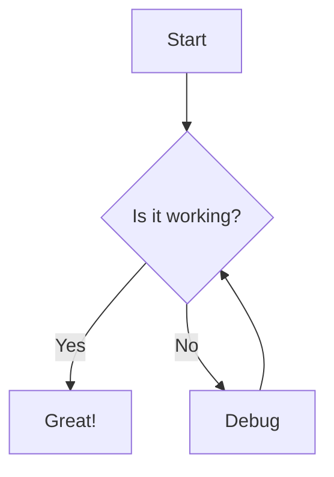

# Supported Charts and Graphs

This document details all the chart and graph types supported by the system, along with their parameters and usage examples.

## 1. Pulse Waveform

**Processor:** `pulse.waveform`

Create digital signal timing diagrams.

### Syntax
```pulse.waveform centered width=600
param: value
...
pulses: ---...
```

### Parameters

| Parameter | Description | Default | Example |
| :--- | :--- | :--- | :--- |
| `y-axis` | Labels for the Y-axis (High/Low states). Separate high and low labels with `\|`. | *None* | `"High" \| "Low"` |
| `x-axis` | Label for the X-axis. | "Time" | `"Time (ns)"` |
| `ticks` | Controls X-axis tick markers. <br> - `auto`: Ticks at every time unit.<br> - `manual`: Ticks only at `\|` markers in pulse string.<br> - List: Space-separated labels corresponding to markers. | `manual` | `t0 t1 t2` or `auto` |
| `grid` | Enable vertical grid lines aligned with markers. | `false` | `true` |
| `pulses` | The waveform definition string (for single channel). | *Required* | `---...` |
| *Channel Name* | Define a named channel in a multi-channel group. The value is the pulse string. | *None* | `Clock: -.-.` |

**Pulse String Characters:**
- `-`: High state (1 unit duration)
- `.`: Low state (1 unit duration)
- `|`: Tick marker (zero duration, used for alignment/ticks)

### Examples

#### Single Waveform
```pulse.waveform centered width=500
y-axis: "1" | "0"
x-axis: "Time"
ticks: t0 t1 t2
grid: true
pulses: ...|---...|---...|
```

#### Multi-Channel Group
```pulse.waveform centered width=600
x-axis: "Cycles"
ticks: auto
grid: true

Clock: -.-.-.-.
Signal: ....----
Enable: --......
```

---

## 2. Schemdraw Circuits

**Processor:** `schemdraw.plot`

Render electrical circuits using Python and the `schemdraw` library.

### Syntax
The content must be valid Python code. The code is executed in a restricted environment with `schemdraw`, `Drawing`, and `elements` (as `elm`) available.

**Automatic Detection:** The processor looks for a `schemdraw.Drawing` object named `d` or any `Drawing` instance created in the scope.

### parameters
- `width`: Output width.
- `centered`: Center the diagram.

### Example

```schemdraw.plot centered
with schemdraw.Drawing() as d:
    d += elm.Resistor().label('100Ω')
    d += elm.Capacitor().down().label('0.1μF')
    d += elm.Line().left()
    d += elm.SourceSin().up().label('10V')
```

---

## 3. Mermaid Diagrams

**Processor:** `mermaid.plot`

Render flowcharts, sequence diagrams, Gantt charts, etc., using Mermaid.js.

### Syntax
Standard Mermaid syntax.

### Parameters
- `sketch`: Enable "hand-drawn" look (if supported by the updated Mermaid version).
- `width`: Max width of the container.
- `height`: Fixed height.

### Example



---

## 4. Digital Logic Circuits

**Processor:** `digital-circuit.plot`

Render digital logic gate diagrams from boolean expressions.

### Syntax
Format: `OutputLabel = Expression` or just `Expression`.

**Operators:**
- `and`, `or`, `not`, `xor`, `nand`, `nor`

### Example

```digital-circuit.plot centered width=600
Q = not (A and B) or C
```

---

## 5. Abstract Syntax Trees (AST)

**Processor:** `ast.plot`

Visualize Lisp-like token hierarchies as a tree structure.

### Syntax
Space-separated tokens. Use parenthesis `(` and `)` to create branches.

### Example

```ast.plot centered
( + 1 ( * 2 3 ) )
```

---

## Common Attributes

These attributes apply to most chart types (added after the language class identifier):

| Attribute | Description |
| :--- | :--- |
| `centered` | Centers the figure on the page. |
| `width=N` | Sets the width of the output (units depend on processor, usually pixels or default SVG units). |
| `height=N` | Sets the height of the output. |
| `sketch` | Enables a rough/sketchy visual style (where supported). |
