# Usando LaTeX com KaTeX

O Course Forge utiliza o [KaTeX](https://katex.org/) para renderizar equações matemáticas de forma rápida e bonita.

## Delimitadores

Os seguintes delimitadores são suportados para escrever matemática no seu markdown:

| Tipo | Delimitadores | Descrição |
|------|---------------|-----------|
| **Display** (Bloco) | `$$ ... $$` ou `\[ ... \]` | Centralizado, em linha própria. Ideal para equações importantes. |
| **Inline** (Linha) | `$ ... $` ou `\( ... \)` | Embutido no texto. Ideal para variáveis como $x$ ou pequenas fórmulas $E=mc^2$. |

## Exemplos Básicos

### Equação em Linha
O teorema de Pitágoras é $a^2 + b^2 = c^2$.

```latex
O teorema de Pitágoras é $a^2 + b^2 = c^2$.
```

### Equação em Bloco
$$
x = \frac{-b \pm \sqrt{b^2 - 4ac}}{2a}
$$

```latex
$$
x = \frac{-b \pm \sqrt{b^2 - 4ac}}{2a}
$$
```

---

## Equações Multilinha e Resultados em Caixas

Para derivações longas onde você deseja alinhar os sinais de igualdade e destacar o resultado final, recomendamos o ambiente `split` dentro de um bloco `$$`.

O caractere `&` é usado para definir o ponto de alinhamento (geralmente antes do sinal `=`).
Use `\\[6pt]` ou `\\[12pt]` para controlar o espaçamento vertical entre as linhas.
Use `\boxed{}` para criar uma caixa ao redor do resultado final.

### Exemplo Completo: Soma e Carry

Este exemplo mostra uma derivação passo a passo com o resultado final destacado em uma caixa, tudo mantendo o alinhamento vertical.

$$
\begin{split}
S &= \overline{A}\,\overline{B}\,C_{in}
 + \overline{A}B\overline{C_{in}}
 + A\overline{B}\overline{C_{in}}
 + ABC_{in} \\[6pt]

&= C_{in}(\overline{A}\,\overline{B} + AB)
 + \overline{C_{in}}(\overline{A}B + A\overline{B}) \\[6pt]

&= C_{in}\,\overline{(A \oplus B)}
 + \overline{C_{in}}(A \oplus B) \\[6pt]

&= A \oplus B \oplus C_{in} \\[6pt]
&\boxed{S = A \oplus B \oplus C_{in}} \\[12pt]

C_{out} &= AB\overline{C_{in}}
 + ABC_{in}
 + A\overline{B}C_{in}
 + \overline{A}BC_{in} \\[6pt]

&= AB(\overline{C_{in}} + C_{in})
 + C_{in}(A\overline{B} + \overline{A}B) \\[6pt]

&= AB + C_{in}(A \oplus B) \\[6pt]

&\boxed{C_{out} = AB + C_{in}(A \oplus B)} \\[12pt]
\end{split}
$$

**Código:**

```latex
$$
\begin{split}
S &= \overline{A}\,\overline{B}\,C_{in}
 + \overline{A}B\overline{C_{in}}
 + A\overline{B}\overline{C_{in}}
 + ABC_{in} \\[6pt]

&= C_{in}(\overline{A}\,\overline{B} + AB)
 + \overline{C_{in}}(\overline{A}B + A\overline{B}) \\[6pt]

&= C_{in}\,\overline{(A \oplus B)}
 + \overline{C_{in}}(A \oplus B) \\[6pt]

&= A \oplus B \oplus C_{in} \\[6pt]
&\boxed{S = A \oplus B \oplus C_{in}} \\[12pt]

C_{out} &= AB\overline{C_{in}}
 + ABC_{in}
 + A\overline{B}C_{in}
 + \overline{A}BC_{in} \\[6pt]

&= AB(\overline{C_{in}} + C_{in})
 + C_{in}(A\overline{B} + \overline{A}B) \\[6pt]

&= AB + C_{in}(A \oplus B) \\[6pt]

&\boxed{C_{out} = AB + C_{in}(A \oplus B)} \\[12pt]
\end{split}
$$
```

### Explicação

1.  **Ambiente `split`**: Envolvemos todo o conteúdo em `\begin{split} ... \end{split}`. Isso permite alinhar várias linhas.
2.  **Alinhamento (`&=`)**: Em cada linha, usamos `&=`. O `&` diz ao LaTeX onde alinhar. Neste caso, todos os sinais de igual ficam um embaixo do outro.
3.  **Resultado em Caixa (`&\boxed{...}`)**: Para o resultado final, também usamos `&` antes do `\boxed`. Isso faz com que a borda esquerda da caixa se alinhe verticalmente com os sinais de igual das linhas anteriores, criando uma hierarquia visual clara onde a resposta "nasce" da derivação.
4.  **Espaçamento (`\\[6pt]`)**: Adicionamos `[6pt]` (ou outro valor) após a quebra de linha `\\` para dar mais respiro entre os passos, melhorando a legibilidade.

# Graphviz Diagrams

**Processor:** `graphviz.plot`

Create professional diagrams using native Graphviz DOT notation with automatic layout.

## Syntax

Uses standard Graphviz DOT notation:


## Graph Types

| Type | Description | Example |
| :--- | :--- | :--- |
| `digraph` | Directed graph (arrows) | `digraph G { A -> B }` |
| `graph` | Undirected graph (lines) | `graph G { A -- B }` |

## Common Attributes

### Graph Attributes

| Attribute | Description | Values | Default |
| :--- | :--- | :--- | :--- |
| `rankdir` | Direction of layout | `TB`, `LR`, `BT`, `RL` | `TB` |
| `splines` | Edge routing style | `curved`, `line`, `ortho`, `polyline` | `line` |
| `nodesep` | Spacing between nodes (inches) | Number | `0.25` |
| `ranksep` | Spacing between ranks (inches) | Number | `0.5` |

### Node Attributes

| Attribute | Description | Values |
| :--- | :--- | :--- |
| `shape` | Node shape | `box`, `circle`, `ellipse`, `diamond`, `plaintext` |
| `style` | Visual style | `filled`, `rounded`, `dashed`, `solid` |
| `color` | Border color | Hex color or name |
| `fillcolor` | Fill color | Hex color or name |
| `fontname` | Font family | Font name |
| `label` | Node label | Text string |

### Edge Attributes

| Attribute | Description | Values |
| :--- | :--- | :--- |
| `color` | Edge color | Hex color or name |
| `penwidth` | Line width | Number |
| `style` | Line style | `solid`, `dashed`, `dotted` |
| `label` | Edge label | Text string |

## Clusters (Subgraphs)

Group related nodes using `subgraph cluster_*`:

```dot
subgraph cluster_name {
    label="Cluster Title"
    style="rounded,filled"
    fillcolor="#f5f5e8"
    
    node1
    node2
}
```

## Examples

### Compiler IR Pipeline

```graphviz.plot centered width=800
digraph CompilerPipeline {
    rankdir=LR
    splines=curved
    nodesep=0.8
    ranksep=1.2

    node [
        shape=box
        style="rounded,dashed"
        fontname="Helvetica"
    ]

    /* Frontends */
    subgraph cluster_frontends {
        label="Frontends"
        style="rounded,filled"
        color="#d6d6a5"
        fillcolor="#f5f5e8"

        c       [label="C"]
        java    [label="Java"]
        python  [label="Python"]
    }

    /* IR */
    ir [
        label="Linguagem Intermediária (IR)"
        shape=box
        style="rounded"
        color="#7a5cff"
        penwidth=2
    ]

    /* Backends */
    subgraph cluster_backends {
        label="Backends"
        style="rounded,filled"
        color="#d6d6a5"
        fillcolor="#f5f5e8"

        x86  [label="x86"]
        arm  [label="ARM"]
        mips [label="MIPS"]
    }

    /* Connections */
    c      -> ir
    java   -> ir
    python -> ir

    ir -> x86
    ir -> arm
    ir -> mips
}
```



### Simple Flow Diagram


### Network Topology


## Common Attributes (Code Block)

These attributes apply to the code block itself:

| Attribute | Description |
| :--- | :--- |
| `centered` | Centers the diagram on the page |
| `width=N` | Sets the maximum width (pixels) |
| `height=N` | Sets the maximum height (pixels) |
| `sketch` | Enables rough/sketchy visual style |

## Resources

- [Graphviz Official Documentation](https://graphviz.org/documentation/)
- [DOT Language Guide](https://graphviz.org/doc/info/lang.html)
- [Node Shapes Gallery](https://graphviz.org/doc/info/shapes.html)
- [Color Names Reference](https://graphviz.org/doc/info/colors.html)

# Supported Charts and Graphs

This document details all the chart and graph types supported by the system, along with their parameters and usage examples.

## 1. Pulse Waveform

**Processor:** `pulse.waveform`

Create digital signal timing diagrams.

### Syntax
```pulse.waveform centered width=600
param: value
...
pulses: ---...
```

### Parameters

| Parameter | Description | Default | Example |
| :--- | :--- | :--- | :--- |
| `y-axis` | Labels for the Y-axis (High/Low states). Separate high and low labels with `\|`. | *None* | `"High" \| "Low"` |
| `x-axis` | Label for the X-axis. | "Time" | `"Time (ns)"` |
| `ticks` | Controls X-axis tick markers. <br> - `auto`: Ticks at every time unit.<br> - `manual`: Ticks only at `\|` markers in pulse string.<br> - List: Space-separated labels corresponding to markers. | `manual` | `t0 t1 t2` or `auto` |
| `grid` | Enable vertical grid lines aligned with markers. | `false` | `true` |
| `pulses` | The waveform definition string (for single channel). | *Required* | `---...` |
| *Channel Name* | Define a named channel in a multi-channel group. The value is the pulse string. | *None* | `Clock: -.-.` |

**Pulse String Characters:**
- `-`: High state (1 unit duration)
- `.`: Low state (1 unit duration)
- `|`: Tick marker (zero duration, used for alignment/ticks)

### Examples

#### Single Waveform
```pulse.waveform centered width=500
y-axis: "1" | "0"
x-axis: "Time"
ticks: t0 t1 t2
grid: true
pulses: ...|---...|---...|
```

#### Multi-Channel Group
```pulse.waveform centered width=600
x-axis: "Cycles"
ticks: auto
grid: true

Clock: -.-.-.-.
Signal: ....----
Enable: --......
```

---

## 2. Schemdraw Circuits

**Processor:** `schemdraw.plot`

Render electrical circuits using Python and the `schemdraw` library.

### Syntax
The content must be valid Python code. The code is executed in a restricted environment with `schemdraw`, `Drawing`, and `elements` (as `elm`) available.

**Automatic Detection:** The processor looks for a `schemdraw.Drawing` object named `d` or any `Drawing` instance created in the scope.

### parameters
- `width`: Output width.
- `centered`: Center the diagram.

### Example

```schemdraw.plot centered
with schemdraw.Drawing() as d:
    d += elm.Resistor().label('100Ω')
    d += elm.Capacitor().down().label('0.1μF')
    d += elm.Line().left()
    d += elm.SourceSin().up().label('10V')
```

---

## 3. Digital Logic Circuits

**Processor:** `digital-circuit.plot`

Render digital logic gate diagrams from boolean expressions.

### Syntax
Format: `OutputLabel = Expression` or just `Expression`.

**Operators:**
- `and`, `or`, `not`, `xor`, `nand`, `nor`

### Example

```digital-circuit.plot centered width=600
Q = not (A and B) or C
```

---

## 4. Abstract Syntax Trees (AST)

**Processor:** `ast.plot`

Visualize Lisp-like token hierarchies as a tree structure.

### Syntax
Space-separated tokens. Use parenthesis `(` and `)` to create branches.

### Example

```ast.plot centered
( + 1 ( * 2 3 ) )
```

---

## 5. Karnaugh Maps

**Processor:** `karnaugh.map`

Visualize boolean logic simplification using Karnaugh maps.

### Syntax
```karnaugh.map centered
names: Variables
outputs: TruthTableBits
```

### Parameters

| Parameter | Description | Example |
| :--- | :--- | :--- |
| `names` | String of variable names (2-4 variables supported). | `AB` or `ABCD` |
| `grid` | Visual 2D grid block. 2-4 variables supported. Follows Gray code order (00, 01, 11, 10). | See example below |
| `groups` | List of groups to highlight. Format: List of cells + optional params. | See example below |

### Styling
- **Auto-Styling**: Providing `color=<name>` applies a predefined **pastel fill** and a matching **darker border**.
- **Supported Colors**: `red`, `blue`, `green`, `yellow`, `orange`, `purple`, `cyan`, `magenta`, `teal`, `pink`, `lime`, `indigo`, `violet`, `gray`.
- **Overrides**: You can specify `fill` explicitly to override the auto-color (e.g. `color=red, fill=#ffffff`).

### Example

```karnaugh.map centered width=250
names: ABCD
grid:
  0 0 1 1
  0 0 1 1
  1 1 0 0
  1 1 0 0
groups:
  - 0011 0010 0111 0110 : color=red
  - 1100 1101 1000 1001 : color=blue
```

---

## Common Attributes

These attributes apply to most chart types (added after the language class identifier):

| Attribute | Description |
| :--- | :--- |
| `centered` | Centers the figure on the page. |
| `width=N` | Sets the width of the output (units depend on processor, usually pixels or default SVG units). |
| `height=N` | Sets the height of the output. |
| `sketch` | Enables a rough/sketchy visual style (where supported). |

---

# Callouts

Use callouts to highlight important information. The syntax is based on the GitHub/Obsidian standard.

**Syntax:**
```markdown
> [!type] Title
> Content...
```

**Supported Types:**
All types support a custom title. The icon is determined by the type.

| Type | Icon | Meaning |
| :--- | :--- | :--- |
| `note` | 📝 | General notes (default) |
| `abstract` | 📋 | Summary or abstract |
| `info` | ℹ️ | Information |
| `todo` | 📅 | To-do items |
| `tip` | 💡 | Tips and tricks |
| `success` | ✅ | Success or completion |
| `question` | ❓ | Questions or FAQ |
| `warning` | ⚠️ | Warnings |
| `failure` | ❌ | Failure or error |
| `danger` | ⚡ | Critical danger |
| `bug` | 🐞 | Bug reports |
| `example` | 🔬 | Examples |
| `quote` | ❝ | Quotations |

# Slides

Turn any Markdown file into a Reveal.js presentation instantly.

**Usage:**
Add `type: slide` to your Frontmatter.

```yaml
---
title: My Presentation
type: slide
---
```

**Creating Slides:**
Use `---` (horizontal rule) to separate slides.

```markdown
# Slide 1
Content...

---

# Slide 2
Content...
```

# Automatic Features

## Download Links
Links to binary files (archives, documents, executables) are automatically detected and styled as download buttons.

**Supported Extensions:**
`.zip`, `.rar`, `.tar`, `.gz`, `.7z`, `.pdf`, `.exe`, `.dmg`, `.bin`, `.deb`, `.rpm`, `.appimage`

**Example:**
`[Download PDF](notes.pdf)` renders as a button.

## Internal Smart Links
Course Forge uses intelligent link resolution to handle symbolic modules and shared content.

- **Markdown Resolution**: Links to `.md` files (`[Link](page.md)`) are automatically converted to `.html` links.
- **Symbolic Resolution**: When a module is included via `source:`, internal links within that module are correctly resolved relative to the new location.

# Project Structure & Configuration

## Recommended Structure

```text
content/
├── config.yaml          # Global site configuration
├── shared/              # Central location for shared modules
│   └── logic-intro/
│       ├── config.yaml  # Set 'hidden: true' to hide from main index
│       └── topic1.md
└── discipline-a/
    └── intro/
        └── config.yaml  # Set 'source: ../../shared/logic-intro'
```

## Configuration

### Global Config (`config.yaml` at root)

```yaml
site_name: My Academic Portal
courses_title: Disciplinas
author: Prof. John Doe
```

### Module Config (`config.yaml` in module folders)

-   `name`: Custom display name for the module.
-   `hidden`: (boolean) If `true`, the module won't appear in the main index list.
-   `source`: (string) Path to another directory to load content from (Symbolic Module).

### Markdown Frontmatter

```markdown
---
title: My Great Topic
type: slide  # Optional: renders as Reveal.js slides
---
```
