# Graphviz Diagrams

**Processor:** `graphviz.plot`

Create professional diagrams using native Graphviz DOT notation with automatic layout.

## Syntax

Uses standard Graphviz DOT notation:


## Graph Types

| Type | Description | Example |
| :--- | :--- | :--- |
| `digraph` | Directed graph (arrows) | `digraph G { A -> B }` |
| `graph` | Undirected graph (lines) | `graph G { A -- B }` |

## Common Attributes

### Graph Attributes

| Attribute | Description | Values | Default |
| :--- | :--- | :--- | :--- |
| `rankdir` | Direction of layout | `TB`, `LR`, `BT`, `RL` | `TB` |
| `splines` | Edge routing style | `curved`, `line`, `ortho`, `polyline` | `line` |
| `nodesep` | Spacing between nodes (inches) | Number | `0.25` |
| `ranksep` | Spacing between ranks (inches) | Number | `0.5` |

### Node Attributes

| Attribute | Description | Values |
| :--- | :--- | :--- |
| `shape` | Node shape | `box`, `circle`, `ellipse`, `diamond`, `plaintext` |
| `style` | Visual style | `filled`, `rounded`, `dashed`, `solid` |
| `color` | Border color | Hex color or name |
| `fillcolor` | Fill color | Hex color or name |
| `fontname` | Font family | Font name |
| `label` | Node label | Text string |

### Edge Attributes

| Attribute | Description | Values |
| :--- | :--- | :--- |
| `color` | Edge color | Hex color or name |
| `penwidth` | Line width | Number |
| `style` | Line style | `solid`, `dashed`, `dotted` |
| `label` | Edge label | Text string |

## Clusters (Subgraphs)

Group related nodes using `subgraph cluster_*`:

```dot
subgraph cluster_name {
    label="Cluster Title"
    style="rounded,filled"
    fillcolor="#f5f5e8"
    
    node1
    node2
}
```

## Examples

### Compiler IR Pipeline

```graphviz.plot centered width=800
digraph CompilerPipeline {
    rankdir=LR
    splines=curved
    nodesep=0.8
    ranksep=1.2

    node [
        shape=box
        style="rounded,dashed"
        fontname="Helvetica"
    ]

    /* Frontends */
    subgraph cluster_frontends {
        label="Frontends"
        style="rounded,filled"
        color="#d6d6a5"
        fillcolor="#f5f5e8"

        c       [label="C"]
        java    [label="Java"]
        python  [label="Python"]
    }

    /* IR */
    ir [
        label="Linguagem Intermediária (IR)"
        shape=box
        style="rounded"
        color="#7a5cff"
        penwidth=2
    ]

    /* Backends */
    subgraph cluster_backends {
        label="Backends"
        style="rounded,filled"
        color="#d6d6a5"
        fillcolor="#f5f5e8"

        x86  [label="x86"]
        arm  [label="ARM"]
        mips [label="MIPS"]
    }

    /* Connections */
    c      -> ir
    java   -> ir
    python -> ir

    ir -> x86
    ir -> arm
    ir -> mips
}
```



### Simple Flow Diagram


### Network Topology


## Common Attributes (Code Block)

These attributes apply to the code block itself:

| Attribute | Description |
| :--- | :--- |
| `centered` | Centers the diagram on the page |
| `width=N` | Sets the maximum width (pixels) |
| `height=N` | Sets the maximum height (pixels) |
| `sketch` | Enables rough/sketchy visual style |

## Resources

- [Graphviz Official Documentation](https://graphviz.org/documentation/)
- [DOT Language Guide](https://graphviz.org/doc/info/lang.html)
- [Node Shapes Gallery](https://graphviz.org/doc/info/shapes.html)
- [Color Names Reference](https://graphviz.org/doc/info/colors.html)
